## A 1D Systolic Finite Impulse Response Filter

processing element of the systolic array. Then we show how this processing element can be replicated to form a filter. Note that there are many ways of designing such filters and this technique is not the best possible implementation on Xilinx's FPGA architectures. This example has been chosen to help illustrate how to describe systolic-style systems in Lava.
NOTE: The filter implementations presented here are designed to illustrate aspects of Lava and are not the recommended implementations for Xilinx's FPGAs. Xilinx's Core Generator contains several optimized filter implementations.

### Finite Impulse Response Filters

The filter we shall build is called a finite impulse response filter (FIR) digital filter which calculate the weighted sum of the current and past inputs. FIR filters are also known as transversal filters or as a tapped delay line. The behavior of the finite impulse response filter can be described by the equation:

<p align="center"> 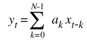</p>

where *y<sub>t</sub>* denotes the output at time *t* and *x<sub>t</sub>* represents the input at time *t* and *a<sub>k</sub>* are the filter coefficients We shall use an "inner product" processing element to perform a single multiplication and addition and then replicate this processing element to make a circuit that compute the filtering function. We shall assume at the coefficients are constants which will allow us to use constant coefficient multipliers in our implementation.

We can model a finite impulse response filter in Haskell (the host language of Lava) with the following code.

```haksell
semisystolicFIR weights xvals [] = [] 
semisystolicFIR weights xvals (xin:xrest) 
  = sum [w * x | (w,x) <- zip weights xvals] : 
    semisystolicFIR weights (xin : init xvals) xrest
```

This function takes three arguments:

* a list of weight values (`weights`)
* a list of the x-values at each tap of the filter (`xvals`)
* a list of input samples where the first sample value is called `xin` and the remainder are called `xrest`

If the input stream is empty i.e. the empty list `[]` then this function returns the empty list. If the input stream is non-empty then the first value in the input list is bound to xin and the remainder of the list is bound to xrest. The `xvals` are paired for multiplication up with their corresponding weight values by using the `zip` list processing function (for matching up elements pair-wise across two lists). The products are added to yield the filter result for this tick. This result is then followed by a list that corresponds to the remainder of the input stream (xrest) being recursively processed by the same function. However, we have to shift along the `xvals` so the `xin` value appears at the first tap. The expression (`init xvals`) returns the original xvals list with the last element removed. This allows us the express the "shifting in" of the new `x` value with the expression `xin : init xvals`.

Although the s`emisystolicFIR` function does not correspond to a Lava circuit it can be used to simulate a filter. For example, assuming we have an input stream which corresponds to sine wave (scaled by 127) we can calculate the result of applying a finite impulse response filter with `weights1 =[3, 9, 15, 7, 5]`. Here is the results of performing such a simulation at the prompt of the ghci Haskell interpreter (looking at only the first 10 values of the input and output).

```haskell
Systolic1DFir> take 10 sineValues [0,9,18,26,35,43,52,60,67,75] Systolic1DFir> take 10 (semisystolicFIR weights1 [0,0,0,0,0] sineValues) [0,0,27,135,375,672,1005,1340,1668,1997]
```

As a final step a filtering function may divide the output by the sum of the coefficients which will scale the output signal back into the range of the input signal (this is note done by this implementation). Choosing coefficients that have sum which is a power of two make it easy to perform such scaling since this corresponds to throwing allow some of the low order bits.

### A Semi-Systolic Filter

First we describe a semi-systolic filter. In a systolic design all the wires between processing elements have at least one latch and all the latches have the same clock signal. In a semi-systolic design this constraint is relaxed to allow wires between processing elements which do not have any latches.

The inner product processing element will take as inputs an accumulated sum from previous processing elements (`yin`), a filter coefficient (`ai`) and a sample value from the input stream (`xin`) and return two values: the `xin` is passed to `xout` and the `yout` is computed by performing the inner product calculation and adding it to the accumulated sum i.e. `yout = yin + ai * xin`. An implementation for an inner product processor is shown below where the purple circle denotes a constant coefficient multiplication by the value `ai` and the green circle denotes an adder. The input `x` values are passed from left to right and the accumulated sums as passed right right to left.

<p align="center"> 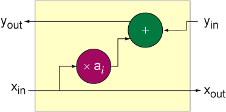</p>

To make a complete filter we need a way of sequencing the `x` values one at a time through each processing element. This can be accomplished by placing a register at the `xin` input of the inner product processing giving the following processing element:

<p align="center"> 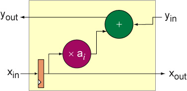</p>

A semi-systolic filter can now be made by composing several comprises of this processing element. We need one processing element for each tap in the filter so a four tap filter would like look:

<p align="center"> 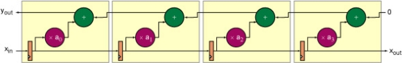</p>

This is a semi-systolic filter because although there are registers on the wires carrying the x values there are no registers on the wires that carry the accumulated sum. The critical path of this circuit goes through four processing elements which makes this a poor implementation choice.

The Lava description of this filter can be used to generate VHDL for simulation and EDIF for implementation using Xilinx's place and route tools. The VHDL simulation shows that the filter behaves as expected:

<p align="center"> 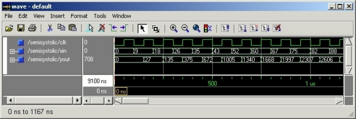</p>

The layout of this filter is shown below implemented in the corner of a Virtex-II FPGA (an XC2V1000-FF896 with speed grade 6).

<p align="center"> 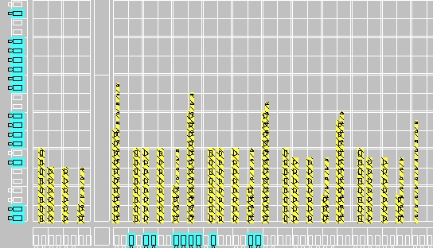</p>

This adders grow taller in a left to right direction as the accumulated sum gets larger. This implementation has a maximum combinational delay of 14.527ns (as reported by the place and route tools) which gives a maximum frequency of 68.8MHz and has 14 logic levels. This implementation uses 119 slices. This layout can be compacted by overlapping some of the pipeline registers with the result of the KCM calculation which also results in a faster implementation.

A better filter can be made by transforming this semi-systolic filter into a systolic filter by the systematic application of three techniques: retiming, slowdown and hold-up.

### The Processing Element

The processing element of the 1D systolic FIR is shown below. Both the `x` values and the accumulated results flow from left to right. Registers are added at the inputs and outputs for pipelining in a way that makes sure the accumulated sums and x values stay in sync.

<p align="center"> 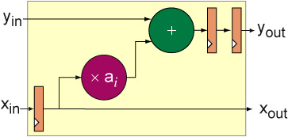</p>

This circuit can be specified by the Lava code below which makes use of [A Constant Coefficient Multiplier Core in Lava](kcm) described in the following section.

```haskell
holdupPE clk k
  =  fsT (registerAndMultiply clk k) >->
     reorg >-> 
     snD ((flexibleUnsignedAdder >|> vreg clk) >-> vreg clk)
     where
     reorg ((a,b),c) = (a,(b,c))
```

### A 4-tap Filter

An example of a four tap filter using this processing element is shown below:

<p align="center"> 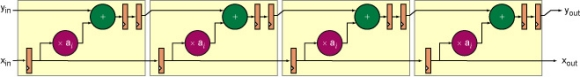</p>

This is formed by simply replicating the processing element horizontally. The `x` input has to be delayed by one clock tick to synchronize with the `y` inputs. When this filter is implemented by the Xilinx place and route tools the last two registers on the x path are automatically pruned as is the unused xout signal. The Lava code for this filter is shown below.

```haskell
holdupFilter :: [Int] -> Bit -> [Bit] -> [Bit]
holdupFilter weights clk xin
  = yout
    where
    (xout, yout) = hser [holdupPE clk k | k <- reverse weights]) 
                   (xin, replicate (length xin) gnd)
```

This filter has a much higher latency (8 ticks) than the semi-systolic filter:

<p align="center"> 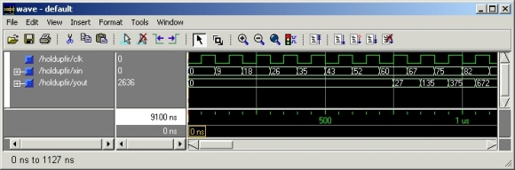</p>

However, since the longest combinational path between any two registers goes through just one processing element. The place and route tools report a maximum clock period of 6.687ns which allows this filter to be run at 150MHz. A more compact but slower filter can be made by realizing the multiple register stages with SRL16 components (shift registers implemented in LUTs which can shift by up to 16 stages). A better implementation can be produced by transforming the semi-systolic implementation into a systolic implementation by the systematic application of three techniques: retiming, slowdown and hold-up.

### Describing The Semi-Systolic Filter

Although the semi-systolic filter is not recommended for FPGA implementation we reproduce the implementation and show how it can be captured in Lava.

<p align="center"> </p>

This architecture can not be directly described by the Lava combinators introduced so far because there is both left to right and right to left data-flow through each block. To help describe such communication patterns we introduce a new combinator called two-way serial and written as `><`:

<p align="center"> 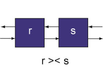</p>

This combinator can then be used to describe a combinator called `twoWayRow` for the serial composition of many identical blocks that have two-way data-flow:

<p align="center"> 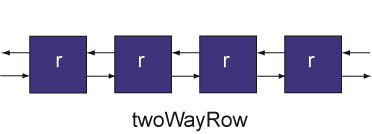</p>

The definition of `twoWayRow` is:

```haskell
twoWayRow = foldl1 (><)
```

Next section: [A Constant Coefficient Multiplier Core in Lava](kcm)