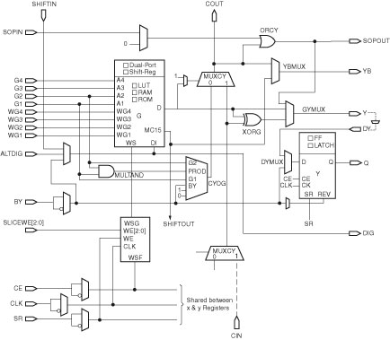

# Lava

## A Hardware Description Language in Haskell
Lava is an experimental system design to aid the digital design of circuits by providing a powerful library for composing structural circuit descriptions. Lava is designed to help specify the layout of circuits which can improve performance and reduce area utilization. An implementation of Lava for Xilinx's FPGAs can be found at Hackage and installed with "cabal install xilinx-lava".
The following pages give a flavor of the Lava HDL and how it can be used to describe circuits for implementation of Xilinx's Virtex family of FPGAs. These pages assume a good understanding of Xilinx's Virtex FPGA architecture and of the Haskell lazy functional programming language. The number of people that know about both can easily fit inside a medium sized elevator. So it may be useful to read A Gentle Introduction to Haskell if you are unfamiliar with functional programming languages. Information about Xilinx's FPGA can be found at
[http://www.xilinx.com]([http://www.xilinx.com). A detailed set of Lava tutorials are also available.

## Describing Netlists in Lava

Structural netlists are described in Lava by composing functions that represent basic library elements or composite circuits. This is very similar to the way the structural netlists are described in VHDL or in Verilog which rely on netlist naming to compose circuit elements. Later we present combinators which provide a much more powerful way to combine circuits.
Most hardware description languages provide a library of basic gates that correspond to the Xilinx Unified Library components. Designers can build up netlists by creating instances of these abstract gates and writing them together. The implementation software maps these gates to specific resources on the FPGA. Most logic functionality is mapped into the slices of CLBs. The top half of a Virtex-II slice is shown below:

  

