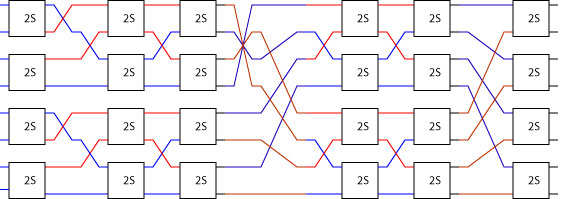

# Lava

<p> </p>
```haskell
sorter cmp 1 = cmp 
sorter cmp n = two (sorter cmp (n-1)) >-> 
               sndList reverse >-> bfly cmp n
```

**TL;DR:** The get a feel for what Lava is and how it is used to design FPGA
circuits with layout skim this page and then go straight to [A Sorter Example in Lava](sorter).

* [A Hardware Description Language in Haskell](#a-hardware-sescription-language-in-haskell)
* [Netlists in Lava](netlists)
* [Layout in Lava](layout)
* [An Adder Example](adder)
* [An Adder Tree in Lava](adder_tree)
* [A Sorter Example in Lava](sorter)
* [A 1D Systolic Finite Impulse Response Filter](fir)
* [A Constant Coefficient Multiplier Core in Lava](kcm)
* [Xilinx Lava Tutorials](old_tutorials)

## A Hardware Description Language in Haskell
[I](http://satnam.fpcastle.com) started developing Lava around 1998 when I worked at Xilinx to help produce FPGA circuits that were more compact and high performance that could practically
achieved using the standard design flow based on VHDL or Verilog. Lava provided higher order combinators for composing both circuit functionality **and** layout
*simultaneously*. This made it tractable for a hardware design engineer to communicate their intuitions about what would lead to a good floorplan by expressing
it using techniques based on [functional geometry](https://dl.acm.org/doi/10.1145/800068.802148). The first paper about this work was
[Lava: hardware design in Haskell](https://dl.acm.org/doi/10.1145/289423.289440) published in 1998.

Lava is realized as an embedded domain specific language in Haskell for composing structural circuit descriptions. It designed to be used for data-path style
structural circuit descriptions i.e. a bottom-up construction of circuits. Lava is not appropriate for circuits that require things like synthesis of finite-state machines from
high level descriptions. However, the Lava circuit combinator library does provide high level tools for making certain kinds of low level circuit design more productive.

This page describes an old version of Lava that was used to produce efficient FPGA circuits with compact layout.
Here I give a flavor of the Lava HDL and how it can be used to describe circuits for implementation on Xilinx's Virtex family of FPGAs (now quite old!). These pages assume a good understanding of Xilinx's Virtex FPGA architecture and of the Haskell lazy functional programming language. The work on Lava and its many variants was done in collaboration with several people including
[Mary Sheeran](http://www.cse.chalmers.se/~ms/) and [Koen Claessen](http://www.cse.chalmers.se/~koen/) at Chalmers University of Technology. A much more recent version of Lava has been
produced by [Andy Gill](https://eecs.ku.edu/andy-gill)'s team called [Kansas Lava](https://ku-fpg.github.io/software/kansas-lava).

I've switched to doing similar kinds of circuit design using a Lava-like DSL embedded in the [Coq](https://coq.inria.fr) theorem prover which
allows us to prove properties about our circuits and have machine checked proofs about the laws of combinator composition.
We call this system Cava (Coq + Lava) which is produced as part of the [Silver Oak](https://github.com/project-oak/oak-hardware) project at Google Research.

Next section: [Netlists in Lava](netlists)
