# Lava

## A Hardware Description Language in Haskell
Lava is an experimental system design to aid the digital design of circuits by providing a powerful library for composing structural circuit descriptions. Lava is designed to help specify the layout of circuits which can improve performance and reduce area utilization.
This page describes an old version of Lava that was used to produce efficient FPGA circuits with compact layout.
The following pages give a flavor of the Lava HDL and how it can be used to describe circuits for implementation of Xilinx's Virtex family of FPGAs. These pages assume a good understanding of Xilinx's Virtex FPGA architecture and of the Haskell lazy functional programming language. The number of people that know about both can easily fit inside a medium sized elevator. So it may be useful to read A Gentle Introduction to Haskell if you are unfamiliar with functional programming languages. Information about Xilinx's FPGA can be found at
[http://www.xilinx.com]([http://www.xilinx.com). A detailed set of Lava tutorials are also available.

## Describing Netlists in Lava

Structural netlists are described in Lava by composing functions that represent basic library elements or composite circuits. This is very similar to the way the structural netlists are described in VHDL or in Verilog which rely on netlist naming to compose circuit elements. Later we present combinators which provide a much more powerful way to combine circuits.
Most hardware description languages provide a library of basic gates that correspond to the Xilinx Unified Library components. Designers can build up netlists by creating instances of these abstract gates and writing them together. The implementation software maps these gates to specific resources on the FPGA. Most logic functionality is mapped into the slices of CLBs. The top half of a Virtex-II slice is shown below:

<p align="center"> </p>

Lava provides a more direct way to specify the mapping into CLB, slices and LUTs. Just like the Xilinx Unified Library the Xilinx Lava library contains specific functions (circuits) that correspond to resources in a Virtex slice e.g. muxcy and xorcy. However, instead of trying to enumerate every possible one, two, three and four input function that can be realized in a LUT Lava instead provides a higher order function for creating a LUT configuration from a higher level specification of the requited function.
As an example consider the task of configuring a LUT to be a two input AND gate. This can be performed by using the lut2 combinator with an argument that is the Haskell function that performs logical conjunction written as `&`.

```haskell
and2 :: (Bit, Bit) -> Bit
and2 = lut2 (&)
```

The lut2 higher order combinator takes any function of two Boolean parameters and returns a circuit that corresponds to a LUT programmed to perform that function. A circuit in Lava has a type that operates over structures of the Bit type. The and2 circuit is defined to take a pair of bits as input and return a single bit as its output.
Note that `lut2` is a higher order combinator because it takes a function as an argument (the `&` function) and returns a function as a result (the circuit which ANDs its two inputs). Indeed the `lut2` combinator can take any function that has the type `Bool -> Bool -> Bool` and it returns a circuit of type `(Bit, Bit) -> Bit`. The type of the `lut2` function is similar to:

```haskell
lut2 :: (Bool -> Bool -> Bool) -> ((Bit, Bit) -> Bit)
```

When Lava generates a VHDL or EDIF netlist for this component it will instance a LUT with the appropriate programming information. Here is what the generated VHDL for the `and2` gate might look like:

```vhdl
 lut2_1 : lut2 generic map (init => "1000") 
          portmap (i0 => lava(5), i1 => lava (6), 
                   o => lava(4)) ;
```

When realized in the top part of a slice as shown in the picture above this gate would be mapped to the upper G function generator which will be configured as a LUT.
As another example consider the definition of a three input AND-gate. First, we define a function in Haskell that performs the AND3 operation:

```haskell
and3 = lut3 and3function
```

The general idea is that instead of trying to provide a library that tries to enumerate some of the one, two, three and four input logic functions Lava provides four combinators lut1, lut2, lut3 and lut4. These combinators take functions expressed in the embedding language (Haskell) and return LUTs that realize these functions. This makes it convenient to express exactly what gets packed into one LUT. Later we will see that these higher order combinators are actually overloaded which allows LUT contents to be specified in many different kinds of ways (including an integer or a bit-vector).
Lava does provide a module that contains definitions for commonly used gates mapped into LUTs. These include:

```haskell
inv = lut1 not
and2 = lut2 (&)
or2 = lut2 (||)
xor2 = lut2 exor
muxBit sel (d0, d1)= lut3 muxFn (sel, d0, d1)
```

assuming the following functions are available in addition to the Haskell prelude:

```haskell
exor :: Bool -> Bool -> Bool 
exor a b = a /= b

muxFn :: Bool -> Bool -> Bool -> Bool
muxFn sel d0 d1 
  = if sel then
      d1
    else 
      d0
```

To make a netlist that corresponds to a NAND gate one could simply perform direct instantiation and wire up the signals appropriate just like in VHDL or Verilog:

```haskell
nandGate (a, b) = d 
                  where 
                  d = inv c
                  c = and2 (a, b)
```

Lava generates a netlist containing two LUT instantiations for this circuit: a LUT2 to implement the AND gate and a LUT1 to implement the inverter. How many LUTs are used to realize this circuit on the FPGA? If no information is given about the location of these two circuits then the mapper is free to merge both the LUT2 for the AND gate and the LUT1 for the inverter into one LUT. However, if the inverter has been laid out in a different location from the AND gate then the two components will not be merged. By default each gate is at logical position (0.0). Since the description above does not translate the two sub-circuits to another location they are understood to occupy the same function generator location and will be merged into one LUT.
A partial list of some of the basic Virtex slice resources supported by Lava is shown below:

```haskell
gnd :: Bit
vcc :: Bit 
fd :: Bit -> Bit -> Bit
fde :: Bit -> Bit -> Bit -> Bit
muxcy :: (Bit, (Bit, Bit)) -> Bit
muxcy_l :: (Bit, (Bit, Bit)) -> Bit
xorcy :: (Bit, Bit) -> Bit
xorcy_l :: (Bit, Bit) -> Bit
muxf5 :: (Bit, (Bit, Bit)) -> Bit
muxf6 :: (Bit, (Bit, Bit)) -> Bit 
muxf7 :: (Bit, (Bit, Bit)) -> Bit
muxf8 :: (Bit, (Bit, Bit)) -> Bit
```

## Layout in Lava

### The Lava Coordinate System

Lava uses a Cartesian coordinate system with the origin at the bottom left hand corner of the screen. A Lava design can have many independent coordinate systems and each of these will be represented by an H_SET in the implementation netlist. The Lava coordinate system is designed to make it easier to produce circuit descriptions that are portable between the Virtex and Virtex-II architectures by abstracting as much as possible the CLB and slice boundaries.
Circuits are conceptually enclosed in rectangular tiles which can be laid out relative to each other. There are two kinds of tiles that Lava supports: (a) two-sided tiles which communicate only along their left and right hand sides and (b) four sided tiles that can communicate along all four sides of the tile.

### Serial Composition

The serial composition combinator in Lava is written as >-> and it takes two circuits as its arguments and returns a new composite circuit. This combinator performs two distinct functions:

* Lava composes behavior by taking the output of the first circuit and connecting it to the input of the second circuit (i.e. like mathematical functional composition but written the other way around).
* Lava places the second circuit to the right of the first circuit. All circuits start off with their bottom left hand corner at location (0,0). By using layout combinators the relative locations of circuits can be modified.

An example of serial composition is shown below for the circuit `and2 >-> inv`. The circuit `and2` takes a pair of signals as its input and returns a single output bit. This is illustrated in the diagram below:

<p align="center"> 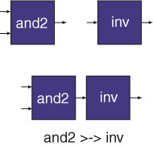</p>

The `and2` circuit is realized in a two-sided Lava tile which means that signals (either inputs or outputs) can occur on the left or right hand sides of the tile but not the top or bottom. The inv circuit is also realized in a two-sided tile. To make an NAND gate form these components all one needs to do is to connect the output of one circuit to the input of the other circuit. This task can be performed by the serial composition combinator without having to name the intermediate signals.

However the serial composition combinator does more than just connect wires together. Serial composition looks at the sizes of the circuits it has to compose and it lays out one circuit directly next to the other circuit with their bottoms aligned. For example consider the tiles containing the `inv` and `and2` gates which which each have size (1,1). The serial composition combinator takes the output of the `and2` gate and connects it to the input of the `inv` gate resulting in a circuit that behaves like a NAND-gate. It also places the `inv` gate to the right of the `and2` gate so it ends up in location (1,0). The composite NAND-gate circuit tile has size (2,1) as shown below.

<p align="center"> 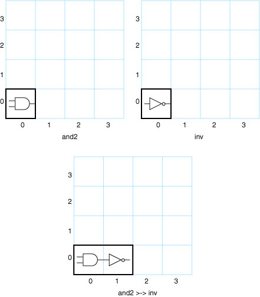</p>

The `and2` gate at Lava location (0,0) has been mapped into the upper LUT of the left hand slice of the CLB at R32C1 i.e. R32C1.S1 (the left hand corner of this Virtex device). The inv component has been mapped into the upper LUT of the right hand slice in the same CLB i.e. R32C1.S0. Note that within the slice the Xilinx tools are free to map to either the upper or lower LUT (F or G). Lava coordinates can specify which logic should be mapped into a slice by requesting either F (y coordinate an even number) or G (y coordinate an odd number) in a relative coordinate system but the Xilinx mapper will decide the actual mapping and absolute location. For the Virtex-II architecture Lava generates slice-based coordinates.

### Parallel Composition

The serial composition combinator is useful when we wish to compose and lay out two circuits that communicate. Sometimes however we wish to lay out circuits relative to each other which do not communication. One of the many combinators that Lava provides for composing circuits in parallel is the `par2` combinator. This combinator takes two two sided tiles and placed the second tile above the first tile aligned along their left hand edges. An example layout for the circuit `par2 inv and2` is shown below:

<p align="center"> 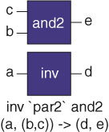</p>

Any circuit or combinator that takes two inputs can be written as in infix operator in Lava by enclosing the name of the circuit or combinator in back quotes as shown above i.e. par2 inv and2 is the same as `` inv `par2` and2``. The par2 combinator produces a composite circuit that takes a two element tuple as its input and returns a two element tuple. The first element of the input tuple is the input destined for the first (lower) circuit and the second element of the input tuple is the input destined for the second (upper) circuit. The first element of the output tuple is the output from the first (lower) circuit and the second element of the output tuple is the output from the second (upper) circuit. The layout of the composite circuit tile of size (1,2) in the Lava coordinate system is shown below.

<p align="center"> 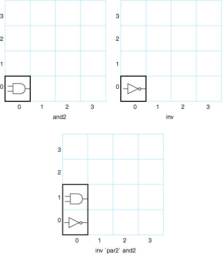</p>

The `par2` combinator operates over just two circuits. Three or more circuits can be composed by using `par2` as an infix operator but this results in circuits with awkward tuple types. The par combinator takes a list of circuits (all of the same type) and lays them out from the bottom to the top:

<p align="center"> 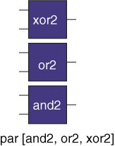</p>

Sometimes it is useful to apply the same circuit to every element of an input bus. We can use the Haskell higher order map function and the Lava par combinator to define a circuit combinator which performs exactly this task. The Lava combinator that maps a circuit across a bus is called `maP` (with a capital P to it does not clash with the Haskell function map) and is defined as:

```haskell
maP r = par (repeat r)
```

This combinator takes any circuit r (which is considered to be a two sided tile) and replicates it as many times as there are elements in the input bus and then layouts out these replicated circuits vertically. For example to invert every bit on a bus one would write `maP inv` resulting in the layout shown below:

<p align="center"> 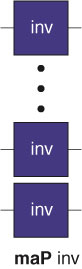</p>

Another use of `maP` is to vertically place registers across each element of a bus. The basic register in Lava that corresponds to FD takes two inputs: the clock and the D input signal. The circuit `vreg` registers each element of a bus and is define as:

```haskell
vreg clk = maP (fd clk)
```

### Serial Overlay Combinator

A register fits in a tile of size (1,1). To describe an AND gate with a register at the output we could use serial composition:

```haskell
and2Reg clk = and2 >-> fd clk
```

This produces the following layout:

<p align="center"> 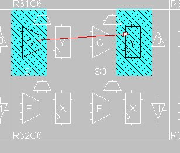</p>

Why is the register realized in the adjacent slice and not the slice containing the function generator for the AND2 gate? This is because the and2 circuit occupies a tile of size (1,1) and the register also occupies a tile of size (1,1) and when the serial composition combinator is asked to put one tile next to the other that is exactly what it does. This results in the register being realized in location (1,0). If this is not what is wanted then a variant of the serial composition combinator can be used to compose two circuits without translating the second circuit. This combinator is called the serial overlay combinator and is written as `>|>`. The circuit `and2 >|> fd clk` will realize both the and2 circuit and the inv circuit into location (0,0) giving:

<p align="center"> 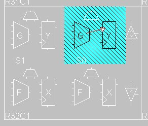</p>

Now the `and2` gate and the FD register are realized in the top half of one slice. Lava will always map and place circuits exactly in the way specified by the layout combinators.

### Describing Non Left-to-Right Dataflow

The `>->` serial composition combinator only composes circuits with a left to right data-flow. There are three other serial compositions combinators that describe right to left `(<-<)`, bottom to top `(/\)` and top to bottom `(\/)` serial composition. They are illustrated below:

<p align="center"> 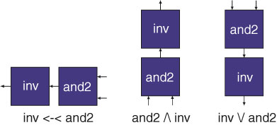</p>

## Four Sided Tiles

### Beside and Below
To describe circuits that communicate on more than two faces of a tile Lava also provides support for four sided tiles. A circuit can be put inside a four sided tile if it has a type which takes a two element tuple as its input and returns a two element tuple as shown below

<p align="center"> 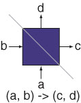</p>

A four sided tile is divided into the input signal and output signal portions by the gray diagonal line. The input to a circuit that fits into a four sided tile must be a tuple (a, b) where the a signal is connected to the bottom of the tile and the b signal is connected to the left of the tile. These signals can be single bits or composite signals. The result type of a circuit that fits into a four sided tile must also be a tuple (c, d) where the c signal is connected to the right hand side of the tile and the d signal is connected to the top of the tile.

To put one four sided tile below another four sided tile requires a new combinator because these tiles do not have the appropriate types for the `par2` combinator. Lava provides the below combinator for this task and the picture below shows the circuit `` r `below` s ``:

<p align="center"> 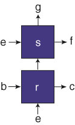</p>

The circuit `r` has the type `(e,b) -> (c, x)` and the circuit s has the type `(x,e) -> (f, g)` and the composite circuit has the type `(e, (b, e)) -> ((c, f), g)` where `x` is the type of the intermediate signal that `r` and `s` communicate along. There is also a beside combinator that lays out `s` to the right of `r`.

### Row and Col

Four sided tiles can be replicated and composed to form columns and rows. The col combinator tiles a circuit r vertically and forms connections between the top and bottom faces of the tile:

<p align="center"> 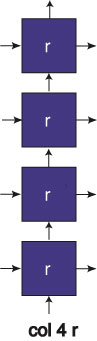</p>

The `row` combinator composes tiles horizontally from left to right and is based on the beside combinator. Rows and column combinators can be used to describe many interesting layout patterns and emulate layout grids which are not four sided. Here is how a hex-connected grid might be described in terms of four sided tiles:

<p align="center"> 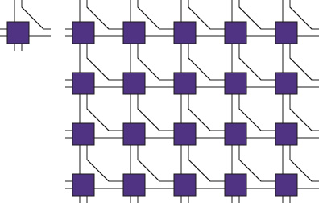</p>

## An Adder Example

### A Ripple Carry Adder Example (using the Virtex Carry Chain)

This section describes how to design a ripple-carry adder in Lava that uses the Virtex carry chain. This component is widely used in many other Lava examples. First we present how to describe a one-bit adder cell using the regular netlist style. Then we use layout combinators to create a vertical column of these cells that make up a carry-chain ripple-carry adder.

### A One-Bit Adder

A one-bit adder can be accommodated in one half of a slice using just one function generator as a LUT, one MUXCY and one XORCY. For this reason we will describe the one-bit adder in netlist style. A schematic for a one-bit carry chain adder is shown below.

<p align="center"> 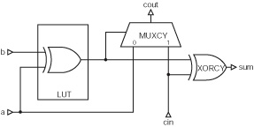</p>

A column layout combinator will be used later to tile several one-bit adders vertically to make an n-bit adder. Before we tile the one-bit adder vertically we have to carefully consider which sides of the tile the signals are connected to. We shall assume a left to right data flow with the two bits to be added connected to the left hand side of the tile and the sum bit appearing from the right hand side of the tile. Since the carry must flow upwards in the Virtex architecture the `cin` signal must come into the bottom of the tile and the `cout` signal must emerge from the top of the tile. This gives the following four-sided tile orientation:

<p align="center"> 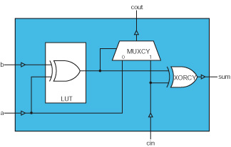</p>

This four-sided tile represents a circuit with input `((a,b), cin)` because `(a,b)` is the left input and cin in the bottom input. This tile also has the output `(sum, cout)` because sum is the right `output` and `cout` is the top output. This fixes the type for this one-bit adder adder tile which can now be described as a Lava netlist as follows:

```haskell
oneBitAdder :: (Bit, (Bit, Bit)) -> (Bit, Bit)
oneBitAdder (cin, (a,b))
  = (sum, cout) 
    where 
    part_sum = xor2 (a, b)
    sum = xorcy  (part_sum, cin)
    cout = muxcy (part_sum, (a, cin))
```

This is very similar to what one would write in VHDL or Verilog except that the instance names are anonymous. Furthermore, the Lava description includes information in the shape of the types that indicates which faces of the tile signals occur and in what order. This is essential in order to compose tiles using combinators which automatically glue together circuit interfaces and layout out circuits in specific patterns.

### A 4-bit Carry Chain Adder

To make a 4-bit adder all we need to do is to tile vertically four one-bit adder tiles:

<p align="center"> 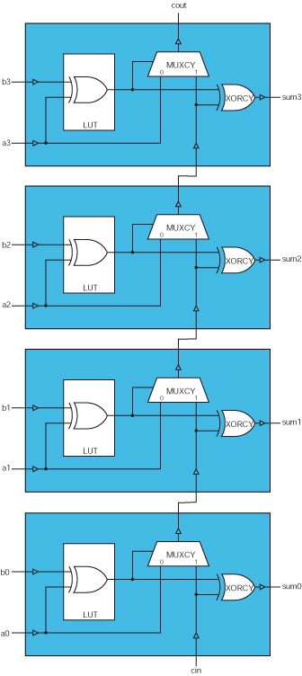</p>

In a conventional HDL this can be described either by copying and pasting the instantiating code for each one-bit adder and then naming intermediate nets which cause components to be connected together to form the composite four-bit adder netlist. Constructs like `for...generate` in VHDL help to capture such repetition more concisely but internal nets still have to be named and there is no information about layout. The Lava description of the circuit show above is simply:

```haskell
col 4 oneBitAdder
```

This is much more concise than equivalent conventional HDL descriptions. It also includes information about layout: the first one-bit adder tile is at the bottom and then the other are stacked on top of it in sequence (RLOCs are generated to enforce this layout). Internal nets are anonymous and circuits are composed automatically by taking the input from below and attaching it to the carry input of the tile.

An example Virtex layout of a 8-bit adder generated by the expression `col 8 oneBitAdder` is show below:

<p align="center"> 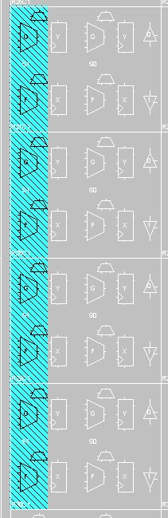</p>

In Lava a parameterized n-bit adder can be defined as:

```haskell
adder :: Int -> (Bit, ([Bit], [Bit])) -> ([Bit], Bit)]
adder n (cin, (a, b))
  = col n oneBitAdder (cin, zip a b)
```

This parameterized adder function uses an integer parameter n to determine the size of the adder. This controls how many one-bit adders are placed in a column. Each one-bit adder is expecting a par of bits on its left edge. To form the correct input for a column of one-bit adders we have to pair-wise associate the two inputs vectors a and b. This is accomplished by using the list processing function `zip` which has the Haskell type `[a] -> [b] -> [(a, b)]`. For example:

```haskell
zip [1, 4, 9] [2, 13, 5] = [(1,2), (4,13), (9,5)]
```

The use of `zip` in adder ensures that the nth bit of `a` is added to the nth bit of `b`.
A specialized version of the adder which has no carry in or carry out can defined as:

```haskell
adderNoCarry :: Int -> ([Bit], [Bit])) -> [Bit]
adderNoCarry n (a,b) 
  = sum 
    where 
    (sum, carryOut) = adder n (gnd, (a,b))
```

This definition uses the gnd component to provide the carry in signal and just discards the carry out.
A registered 4-bit adder can be made by composing the `adderNoCarry` component and the `vreg` component using `>|>` (the serial overlay operator) to make sure the adder and register share the same location:


<p align="center"> </p>

A parameterized n-bit registered adder can be defined as:

```haskell
registeredAdder :: Int -> Bit -> ([Bit], [Bit]) -> [Bit]
registeredAdder n clk = adderNoCarry n >|> vreg clk
```

The Virtex layout produced for `registeredAdder 4` is shown below.

<p align="center"> 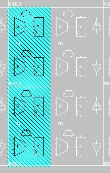</p>

## An Adder Tree in Lava

Consider the task of adding eight numbers n1, n2, .. n8 use a binary tree of adders as shown below.

<p align="center"> 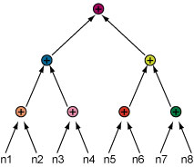</p>

In a language like VHDL one can write a recursive function that takes an unconstrained array of numbers as input and returns their sum computed with an adder tree. However, there is no standard way in VHDL of specifying how the adder tree should be laid out. Adder trees are typically pipelined and it takes just one adder to be badly placed to degrade the performance of the whole adder tree. Since Lava can specify how the adders are to be laid out the design engineer can make decisions and calculations about intermediate wire delays. One example layout scheme for a pipelined adder tree is shown below (the clock wires are now shown):

<p align="center"> 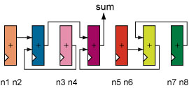</p>

This layout scheme places the adders in a row with the final addition occurring in the middle. Both the left and right hand sides of the final adder also contain adder trees in which the final sum occurs in the middle. This recursive structure continues until the leaf additions are encountered (e.g. the adder for n1 and n2).

### The middle Combinator

<p align="center"> 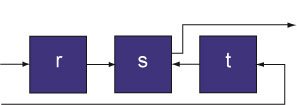</p>

Note that this combinator produces a two-sided tile which has two inputs on the left and one output on the right.

## Tree Circuits in Lava

Using the middle combinator we can define a tree circuit combinator for any kind of two input and one output circuit:

```haskell
tree circuit [a] = a 
tree circuit [a, b] = circuit (a, b) 
tree circuit xs 
  = middle (tree circuit) circuit (tree circuit)(halve xs) 
```

* The first line of this definition is used when a singleton list is given to the tree circuit. In this case the result is just the sole element of the list.
* The second line is used when a two element list is used with a tree circuit. In this case the result is obtain by processing the two inputs with the circuit that is the first parameter of the tree combinator.
* In the third line case the middle circuit will be the parameterized two input and one output circuit and the left and right circuits will be recursively defined trees of this circuit. The input is halved with the first half going to the left sub-tree and the second half going to the right sub-tree.

A combinational adder tree with bit-growth can be made with the flexibleAdder circuit. This circuit has the type `(Bit, Bit) -> (Bit)` so it is suitable for use as an element of an adder tree. To define a combinational adder tree one simply writes:

```haskell
adderTree = tree flexibleAdder
```

It is possible to rewrite a call to the tree combinator to see how it works for a particular circuit and input list:

```haskell
tree flexibleAdder [i1, i2, i3, i4]
  = (middle (tree flexibleAdder) circuit (tree flexibleAdder)) (halveList [i1, i2,i3, i4]) 
  = (middle (tree flexibleAdder) circuit (tree flexibleAdder)) [[i1, i2], [i3, i4]] 
  = flexibleAdder (tree flexibleAdder [i1, i1], tree flexibleAdder [i2, i3]) 
  = flexibleAdder (i1+i2, i3+i4) 
  = i1+i2+i3+i4
```

We can use the `flexibleAdderFD` circuit to make a pipelined adder tree:

```haskell
adderTreeFD clk = tree (flexibleAdderFD clk)
```

The adders in this tree will use FD register components. An example layout of four 96-input pipelined adder trees stacked upon each other is shown below on a XCV300 part. The bit-growth in the adder tree helps to identify the recursive nature of the layout.

<p align="center"> 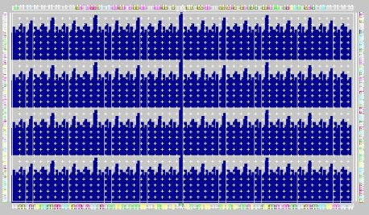</p>

The adder trees shown above sum 96 9-bit numbers each and with this layout the circuit operates at 173MHz on a XCV300 at speed grade 6. If the layout information is removed and the same netlist is placed and routed again the maximum speed is 129MHz i.e. 34% slower. The graph below shows that specifying layout had significant performance advantages. The blue bars represent the speed of circuits with layout information and the red bars represented the speed of the same netlist with the layout information (RLOCs) removed. Each pair of bars corresponds to a target timing specification. The leftmost pair of bars is for the case where the place and route tools were asked to meet a timing specification of 180MHz but delivered 173MHz for the RLOC-ed circuit and 129MHz without the RLOCs.

<p align="center"> 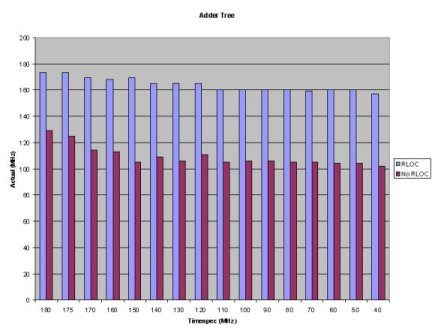</p>

Providing layout information also speeds out the place and route times as shown in the graph below. For the 180MHz timespec case the netlist with layout took less then 400 seconds to route (nothing needs to be placed) but took more than 1800 seconds to place and route without layout information.

<p align="center"> 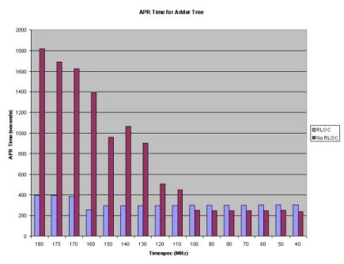</p>

The FPGA Editor view of the four placed adder trees is shown below.

<p align="center"> 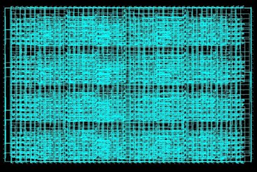</p>

Without the RLOCs the following implementation is produced:

<p align="center"> 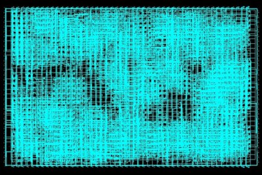</p>

The adder tree layout was easy to express in Lava and has produced significant performance advantages. Many other tree layout schemes can be easily explored in Lava. It is also very easy to make trees of other kinds of circuits like multiplier etc. All one has to do is to supply such circuits to the first argument of the `tree` combinator.

## A Constant Coefficient Multiplier (KCM) Core in Lava

This section describes how to build a constant coefficient multiplier (KCM) for the Virtex family of FPGAs using a combination of table lookups and additions. There are many other kinds of KCM: this one has been chosen to help illustrate how to design with distributed memory components in Lava.

The architecture of this multiplier is based on performing many 4-bit (or smaller) multiplications and then combining the results of these partial products with a weighted adder tree. Optionally the adder tree can be pipelined. The reason for performing 4-bit multiplications is that these can be performed quickly with lookup tables (since each LUT has four inputs). A specific multiplier generated by the Lava KCM core is shown below.

<p align="center"> 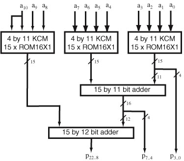</p>

This KCM multiplies a 11-bit signed dynamic input *A* = *a*<sub>10</sub>..<sub>0</sub> by a 11-bit constant coefficient *K*. The multiplication *AK* is performed by composing the results of several four-bit multiplications by exploiting the identity:

*AK* = -2<sup>8</sup> *a*<sub>10</sub>..<sub>8</sub>*K* + 2<sup>4</sup> *a*<sub>7</sub>..<sub>4</sub> *K* + *a*<sub>3</sub>..<sub>0</sub>*K*


