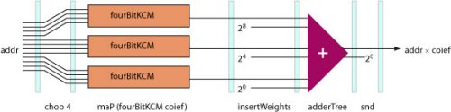
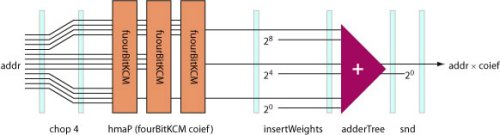
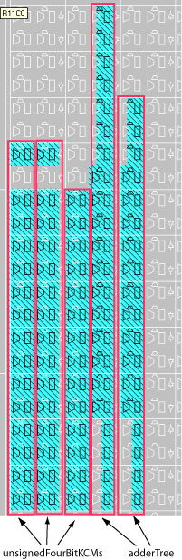
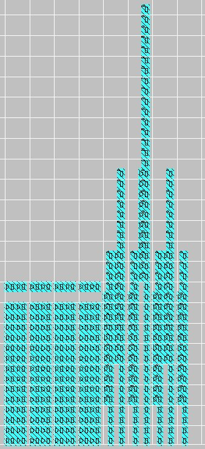

## A Constant Coefficient Multiplier Core in Lava

This section describes how to build a constant coefficient multiplier (KCM) for the Virtex family of FPGAs using a combination of table lookups and additions. There are many other kinds of KCM: this one has been chosen to help illustrate how to design with distributed memory components in Lava.

The architecture of this multiplier is based on performing many 4-bit (or smaller) multiplications and then combining the results of these partial products with a weighted adder tree. Optionally the adder tree can be pipelined. The reason for performing 4-bit multiplications is that these can be performed quickly with lookup tables (since each LUT has four inputs). A specific multiplier generated by the Lava KCM core is shown below.

<p align="center"> </p>

This KCM multiplies a 11-bit signed dynamic input *A* = *a*<sub>10</sub>..<sub>0</sub> by a 11-bit constant coefficient *K*. The multiplication *AK* is performed by composing the results of several four-bit multiplications by exploiting the identity:

*AK* = -2<sup>8</sup> *a*<sub>10</sub>..<sub>8</sub>*K* + 2<sup>4</sup> *a*<sub>7</sub>..<sub>4</sub> *K* + *a*<sub>3</sub>..<sub>0</sub>*K*

The rightmost table multiplies the lower four bits of the inputs by the constant coefficient i.e. *X* = *a*<sub>3</sub>..<sub>0</sub>*K* and the middle table computes *Y* = *a*<sub>7</sub>..<sub>4</sub>*K* where both *a*<sub>3</sub>..<sub>0</sub> and *a*<sub>7</sub>..<sub>4</sub> are treated as unsigned numbers. The leftmost table calculates *Z* = (*a*<sub>10</sub>, *a*<sub>10</sub>, *a*<sub>9</sub>, <sub>a8</sub>)*K* where (*a*<sub>10</sub>, *a*<sub>10</sub>, *a*<sub>9</sub>, <sub>a8</sub>)is treated as a sign-extended bit-vector. To calculate the final results the partial products *Y* and *Z* have to be appropriately weighted before addition A weighted adder tree is used to compose the partial products and the size of the intermediate adders is reduce by reading off directly the bottom four bits of the partial product *X* and the result of adding the remaining bits of *X* to *Y*. For the pipelined version of this multiplier Lava places registers on the intermediate wires making sure to balance the delays.

The four-bit multiplications are performed by table lookups using distributed memory (i.e. LUTs). In this case an 11 bit constant must be multiplied by a four bit dynamic input which requires a table with a 15-bit output. This can be easily made by using 15 four-input LUTs all with the same input. To avoid unwanted mapper optimizations we use the ROM16X1 component to create a LUT with specific lookup table contents.

Lava provides a family of functions that make it easy to create tables made out of ROM16X1 components. One of the functions available from the Lava LUTROM module is rom16x which will create a four-input n-output table from data specified as a list of numbers.

```haskell
lut16x :: [Int] -> (Bit, Bit, Bit, Bit) -> Bit
```

The code for a four-bit unsigned KCM in Lava is shown below.

```haskell
unsignedFourBitKCM :: Int -> [Bit] -> [Bit] 
unsignedFourBitKCM coeif addr
  = rom16x maxwidth multiplication_results padded_addr 
    where 
    padded_addr = padAddress addr
    nr_addrs = length addr
    multiplication_results 
      = pad_width 0 16 [coeif * i | i <- [0..2^nr_addrs-1]]
    maxwidth 
      = maximum 
         (map unsignedBitsNeeded multiplication_results)
```

The first parameter to this function is coeif which is the constant coefficient. The second argument is a bit-vector which is represented as a list in Lava (with the LSB as the first element). To allow multiplications by bit-vectors less then four bits in width this function pads out the table with zero values for smaller multiplications. This is done by first forming a table of the multiplication results i.e.

```haskell
[coeif * i | i <- [0..2^nr_addrs-1]]
```

which for an address less than four bits will have less than 16 elements. Then the pad_width function is used to add zero elements to end of the list to bring the length of the list up to 16. The result is bound to the variable name multiplication_results which is examined to find the largest product which in turn is used to determine how many output bits are required (`maxwidth`). Now the product can be computed by by forming a 16 element table with `maxwidth` output bits using the `rom16x` function. A singed four-bit KCM can be built in a similar manner (this time using sign extension on the input bits).

To make an unsigned KCM the following steps are taken:

* The input bus is chopped into groups of 4-bits. This is achieved using the chop list function.
* Each of these 4-bits is multiplied by the constant coefficient using the `unsigedFourBitKCM` circuit. This can be easily done by the expression `maP (unsignedFourBitKCM coeif)` which places the 4-bit KCMs on top of each other.
* The results of each of these partial products has to be suitably weighted to allow them to be combined. This is done by zipping the partial products bus with the list [2<sup>0</sup>, 2<sup>4</sup>, 2<sup>8</sup>...]
* A weighted adder tree is used to sum the partial products. Combinational and pipelined KCMs will have different adder trees but we would like to abstract over this difference so that one generic unsigned KCM function needs to be written. This can be done by passing the required adder tree circuit as a higher order circuit.
The result of the weighted adder tree circuit is a pair which has 2<sup>0</sup> as the first element and the final product as the second element. Since we only want the product we just use the `snd` function to project it out.

Each of the stages described above is composed in series as shown below for the case of a 12-bit dynamic input:

<p align="center"> </p>

Since each unsignedFourBitKCM is long and thin it is better to lay them out horizontally by using the horizontal version of the `maP` combinator called `hmaP`:

<p align="center"> </p>

This picture leads to the Lava definition of `unsignedKCM` shown below:

```haskell
unsignedKCM fourBitKCM adderTree coeif 
  = chop 4 >->
    hmaP (fourBitKCM coeif) >->
    insertWeights >-> 
    adderTree >->
    snd
```

Note how the specific four-bit KCM circuit to be used is passed as a higher order parameter. The `unsignedKCM` higher order circuit can be instantiated with a specific four-bit KCM to make either combinational or sequential KCMs. Similarly the `adderTree` circuit is passed as a higher order circuit. To make a specific unsigned KCM we also need to specify exactly which adder tree circuit to use. If we used a combinational weighted tree the resulting KCM would be a combinational circuit.

To help design a weighted adder we define a type that describes the "virtual" signals that flow along the wires of a weighted adder. The type `WtNr` is defined to be a tuple which contains a weight represented as an integer and a bit-vector. These signals are called "virtual" because the weight component is an integer which is only used during elaboration and does not correspond to a wire in the circuit.

```haskell
type WtNr = (Int, [Bit])
```

The `unsignedWeightedAdder` circuit takes a pair of such weighted numbers and returns a weighted number. This is expressed by the following type signature:

```haskell
unsignedWeightedAdder :: (WtNr, WtNr) -> WtNr
```

This circuit assumes the first element of the input pair has a larger weight than the second element. If this is not the case this circuit calls itself again with the elements of the pairs swapped. This is achieved by using a pattern match guard to ensure that the first input has a higher weight than the second input:

```
unsignedWeightedAdder 
  ((weight1 ,a1), (weight2,a2)) | weight1 < weight2
  = unsignedWeightedAdder ((weight2, a2), (weight1,a1))
```
Otherwise `unsignedWeightedAdder` computes the difference between the two weights to compute how many of the lower bits of the second input to pass through. The remaining bits are then added to the first input to compute the upper bits of the final sum. The weight of the result is the higher input weight and the resulting addition is formed by composing the bit-vector from the addition with the lower bits.

```haskell
unsignedWeightedAdder ((weight1,a1), (weight2,a2))
  = (weight2, lower_bits ++ part_sum)
    where
    weight_difference = weight1 - weight2 
    lower_bits = take weight_difference a2
    a2Upper = drop weight_difference a2
    part_sum = flexibleUnsignedAdderNoGrowth (a1, a2Upper)
```

Putting these lines of code together produces the complete code for the `unsignedWeightedAdder` circuit:

```haskell
unsignedWeightedAdder :: (WtNr, WtNr) -> WtNr
unsignedWeightedAdder
  ((weight1 ,a1), (weight2,a2)) | weight1 < weight2
  = unsignedWeightedAdder ((weight2, a2), (weight1,a1))
unsignedWeightedAdder ((weight1,a1), (weight2,a2))
  = (weight2, lower_bits ++ part_sum)
    where
    weight_difference = weight1 - weight2 
    lower_bits = take weight_difference a2
    a2Upper = drop weight_difference a2
    part_sum = flexibleUnsignedAdderNoGrowth (a1, a2Upper)
```

To make a specific unsigned combinational KCM we just need to give a tree of unsigned weighted adders to the `unsignedKCM` circuit:

```haskell
unsignedCombinationalKCM 
  = unsignedKCM unsignedFourBitKCM 
                (tree unsignedWeightedAdder)
```

To make a pipelined KCM we need to provide the `unsignedKCM` circuit with a pipelined version of the four-bit KCM circuit and a pipelined version of the weighted adder tree circuit. A pipelined version of the four-bit KCM just places a register at the output of the lookup tables with a `C` clock input and a `CE` clock enable input. This circuit is called `unsignedFourBitKCMCE` and is easily defined as:

```haskell
unsignedFourBitKCMCE clk ce coeif
  = unsignedFourBitKCM coeif >|> vregE clk ce
```

i.e. a combinational four-bit unsigned KCM serially composed (by overlaying) with a register-bus with clock and clock enable inputs. An unsigned weighted adder tree can be made by making a tree of unsigned weighted adders that have their outputs registered in a similar manner. This allows a registered unsigned KCM to be defined as:

```haskell
unsignedRegisteredKCM clk ce 
  = unsignedKCM (unsignedFourBitKCMCE clk ce) 
                (tree (unsignedWeightedRegisteredAdder clk ce))
```

Note how much of the commonality of the basic structure of the combinational and pipelined KCMs has been captured by the `unsignedKCM` higher order circuit.

The layout produced for a pipelined unsigned 11-bit dynamic input and 11-bit constant is shown below for a Virtex part.

<p align="center"> </p>

On a XCV300-4-BG432 part this circuit runs at a speed of at least 196MHz. The layout for an unsigned KCM with a 32-bit dynamic input and an 11-bit coefficient is shown below.

<p align="center"> </p>

The 4-bit multiplications occur in the rectangular block on the left and the weighted adder tree is shown on the right hand side of the picture. On a XCV300-4-BG432 this circuit operates at a speed of at least 130MHz. Many other layouts are possible e.g. to place the 4-bit multiplications closer to their corresponding adders at the leaves of the adder tree.

Next section: [Xilinx Lava Tutorials](old_tutorials)