## A Sorter Example in Lava

### Sorting with Butterfly Networks

This section describes how to build a sorter circuit using butterfly networks which are carefully placed to ensure high performance. The sorter circuit is made by recursively merging the results of sub-sorts. A top-level schematic of the circuit that we present in this section is shown below. The merger that we present is bitonic which requires the first half of the input list to be increasing and the second half decreasing (or vice versa). The result of the top sorter is reversed to accommodate this requirement.

<p align="center"> 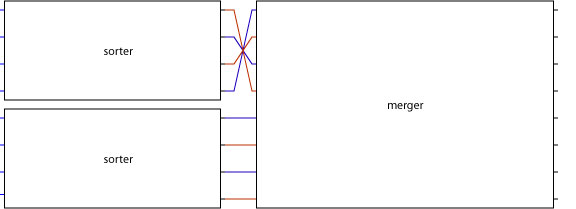</p>

### Batcher's Bitonic Merger

Given the ability to sort two numbers and the diagram above we have a recursive formula for making sorters of any size. First the availability of a two sorter is assumed and the merger is designed. Then the implementation of the two sorter is given.

A merger called Batcher's Bitonic Merger can be made by using a butterfly of two sorters. Here is an example of a specific butterfly network of two sorters (written as 2S) which merges eight numbers:

<p align="center"> 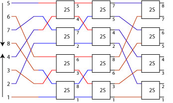</p>

To help describe such butterfly networks in Lava a few useful circuit combinators are introduced.
From the top level description we see that a reverse operation is required and we can simply use the built in Haskell `reverse` function:

<p align="center"> </p>

Another very useful wiring combinator is called `riffle` and an instance of it is shown below:

<p align="center"> 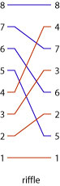</p>

This wiring combinator interleaves the odd and even elements of the input list (shown on the left). It can be defined in Lava as:

```haskell
riffle = halve >-> ziP -> unpair
```

The halve function splits a list into two halves which are returned in a two element tuple. The `ziP` combinator takes a pair of lists and returns a new list of pairs by associating each element in the first list with the corresponding element in the second list. The unpair function then flattens this list of pairs into a list.

It is also useful to be able to perform the inverse function of riffle called `unriffle`. This circuit can be thought of as the reflection of the riffle circuit along a vertical axis as shown below.

<p align="center"> 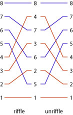</p>

The definition of `unriffle` in Lava is given below.

```haskell
unriffle = pair >-> unzip >-> unhalve
```

Sometimes a bus containing n elements is processed by using two copies of a circuit such that the first copy of the circuit operates on the bottom half of the input and the second copy of the circuit operates on the top half of the input as shown below for a four input bus:

<p align="center"> 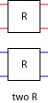</p>

The combinator that performs this task is called `two` and is easily defined in Lava:

```haskell
two r = halve >-> par [r,r] >-> unhalve
```

Note that this combinator placed the first copy of `r` below the second copy of `r`. A specific instance of this combinator is two `two_sorter` which is shown below:

<p align="center"> 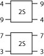</p>

Another combining form that uses two copies of the same circuit is `ilv` (pronounced "interleave"). This combinator has the property that the bottom circuit processes the inputs at even positions and the top circuit processes the inputs at the odd positions. An instance of `ilv R` for an eight input bus is shown below.

<p align="center"> 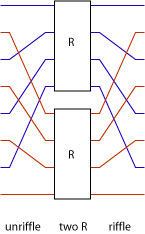</p>

The `ilv` combinator can be defined by noticing the it is the composition of an `unriffle`, `two R` and `riffle`:

```haskell
ilv r = unriffle >=> two r >=> riffle
```

The evens combinator chops the input list into pairs and then applies copies of the same circuit to each input. The argument circuit for evens must be a pair to pair circuit. An instance of `evens two_sorter` over an eight input list is shown below.

<p align="center"> 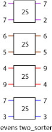</p>

This combinator is defined as:

```haskell
evens f = chop 2 >-> maP f >-> concat
```

Using the combinators shown above we can now describe a butterfly network of some circuit `r` (such that `r` is a pair to pair circuit):

```haskell
bfly r 1 = r
bfly r n = ilv (bfly r (n-1)) >-> evens r 
```

Here is a picture of `bfly r 1`:

<p align="center"> </p>

This makes sense in the case of a two sorter since a butterfly of size 1 has 2 inputs which can be sorted by a single two sorter. The layout for `bfly r 2` is:

<p align="center"> </p>

The left hand side of this picture shows an interleave of `R` and the right hand side shows `evens R`. The layout for `bfly r 3` is:

<p align="center"> 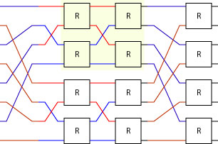</p>

Note that a sub-butterfly of size 2 has been identified with a pale background. It can be instructive to unfold the `bfly r 3` expression and then try and spot where the various combinators occur in the picture.

```haskell
bfly r 3 
  = ilv (bfly r 2)) >-> evens r 
  = ilv (ilv r >-> evens r) >-> evens r
```

To make a merger all we need to do is to instance this butterfly with a two sorter. Here is a picture of `bfly r two_sorter` (also shown before):

<p align="center"> </p>

This solves the right hand side of the sorter architecture since `bfly two_sorter` makes a bitonic merger:

<p align="center"> 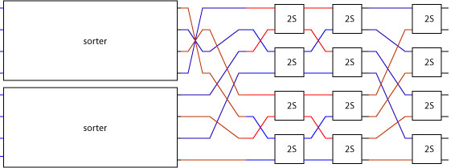</p>

The two remaining sorters can be recursively decomposed using exactly the same technique used to decompose the top level sorter. For example, the upper sorter can be implemented by using a merger (shown on the right) and then sorting the two sub-lists. Since each sub-list contains just two elements we get to the base case of the recursion and deploy a two sorter.

<p align="center"> 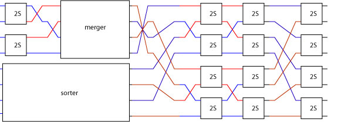</p>

But how is the merger realized? As before, it is just a butterfly of two sorters, in this case `bfly 2 two_sorter`:

<p align="center"> 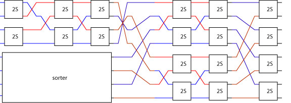</p>

Applying the same technique to the lower sorter gives the complete architecture for a size 3 sorter (i.e. 2^3 inputs = 8):

<p align="center"> </p>

Although it is not at all obvious this circuit sorts eight numbers it has been systematically derived from a simple procedure which can be codified in Lava as:

```haskell
sorter cmp 1 = cmp 
sorter cmp n = two (sorter cmp (n-1)) >-> 
               sndList reverse >-> bfly cmp n
```

This description says that a sorter of degree 1 (i.e. 2 inputs) can be made using a two sorter. A larger sorter is made by using two small sorters, then reversing the result of the upper sort, and then merging these sub-sorts using a butterfly of two sorters. Note that this sorter description is parameterized on the specific sorter to be used.

An instance of `sorter two_sorter` produces a pipelined 8 input sorter which is shown below on a Virtex-II device:

<p align="center"> 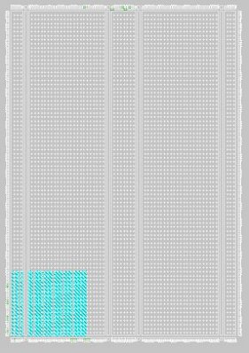</p>

Note that since Lava combinators include layout as well as connectivity information the resulting circuit occupies a rectangular area which corresponds to the pictures shown above.

A degree 4 (i.e. 16 inputs) sorter is shown below:

<p align="center"> 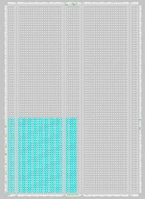</p>

A degree 5 (i.e. 32 inputs) sorter is shown below:

<p align="center"> 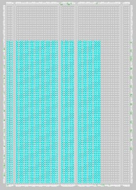</p>

A slightly larger version of the network above which sorts 32 16-bit numbers each clock tick operates at 165MHz on a XC2V3000 part with a latency of 14 clock ticks (using the 4.1i version of the Xilinx design tools). Larger data-sets can be sorted by storing numbers in BlockRAM and then iteratively sorting and merging. More details can be found in the paper
[Design and Verification of a Sorter Core](https://dl.acm.org/doi/10.5555/646705.702175).

Some instances of these butterfly networks were implemented on a XCV300 FPGA and ChipScope was used to verify that the real hardware actually did sort numbers:

<p align="center"> 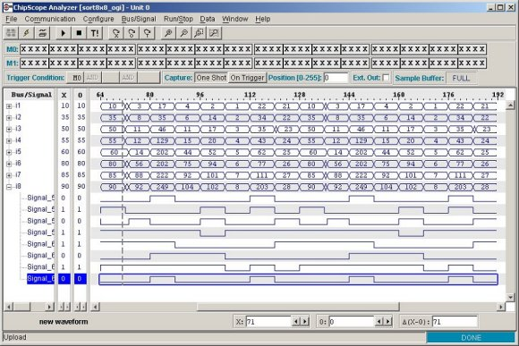</p>

Next section: [A 1D Systolic Finite Impulse Response Filter](fir)
